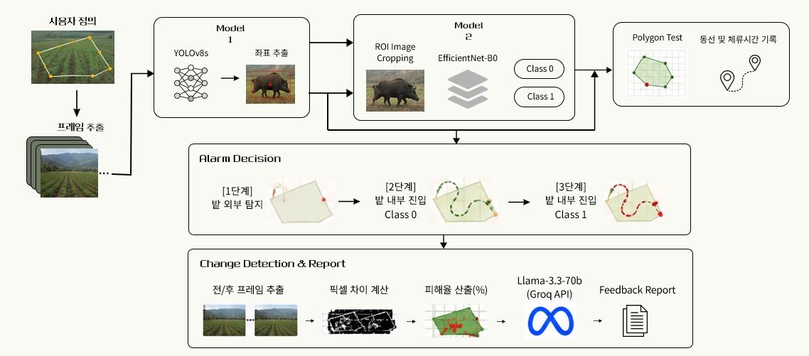

# 🐗 멧돼지 소믈리에 (Wild Boar Field Monitor)

농경지에 침입한 멧돼지를 실시간 탐지하고, 행동을 분류해 **3단계 위기 알람**과 **AI 피해 리포트**를 자동 생성하는 딥러닝 모니터링 시스템입니다.

> 팀 프로젝트 (2인) | 2025 5~6월  
> 역할: 팀장 / 전체 기획 및 파이프라인 설계, 모델 학습, 데이터 라벨링

---

## 📌 Problem

멧돼지로 인한 농작물 피해는 오랜 기간 해결되지 않고 있으며, 기존 퇴치 방식(소음기, 포획 트랩 등)은 멧돼지가 빠르게 적응해 효과가 떨어집니다.
피해 발생 후에도 침입 경로나 행동 패턴이 기록되지 않아 반복 피해를 막기 어렵습니다.
단순 탐지·퇴치를 넘어 **행동 분류 + 경로 추적 + 사후 리포트**까지 제공하는 시스템을 목표로 했습니다.

---

## 🔧 Pipeline


```
입력 프레임
→ [Model 1] YOLOv8s: 멧돼지 객체 탐지 + 바운딩 박스 좌표 추출
→ ROI 크롭 이미지 생성
→ [Model 2] EfficientNet-B0: 훼손 행동 이진 분류 (Class 0: 일반 / Class 1: 훼손 중)
→ Polygon Test (밭 구역 내/외 판별)
→ 3단계 알람 결정
   - 1단계: 밭 외부 반경 탐지
   - 2단계: 밭 구역 침범
   - 3단계: 밭 안에서 훼손 행동(Class 1) 감지
→ 이동 경로 및 체류 시간 기록
→ Change Detection: 전/후 프레임 픽셀 차이 → 피해율(%) 산출
→ Groq LLaMA-3.3-70b: 사후 방지 리포트 자동 생성
```

---

## 📊 Results

| Model | Metric | Score |
|-------|--------|-------|
| YOLOv8s (객체 탐지) | mAP@0.50 | **0.993** |
| YOLOv8s (객체 탐지) | mAP@0.50-0.95 | **0.959** |
| EfficientNet-B0 (행동 분류) | Val Accuracy | **88.96%** |

---

## 📂 Dataset

- **AI-Hub 야생동물 활동영상 데이터셋 (멧돼지 클래스만 사용)**: 객체 탐지 학습용 (YOLOv8s 파인튜닝)
  - COCO 기본 80개 클래스에 멧돼지 미포함 → 도메인 특화 파인튜닝 필요
  - - **행동 라벨링(수동 진행)**: Class 0 (일반 이동/경계) / Class 1 (땅 파헤치기·작물 섭취) 이진 분류 
- **Vidu-AI 가상 영상 데이터**: 멧돼지 훼손 시나리오 데모 영상 제작

---

## 🛠️ Tech Stack

- **Detection**: YOLOv8s (Ultralytics)
- **Classification**: EfficientNet-B0 (BCEWithLogitsLoss, Adam)
- **Change Detection**: OpenCV 픽셀 차이 비교
- **LLM Report**: Groq API (LLaMA-3.3-70b)
- **Libraries**: PyTorch, OpenCV, Ultralytics

---

## 📁 Structure

```
├── boarsommelier-model1.ipynb      # YOLOv8s 파인튜닝 (Detection)
├── boarsommelier-model2.ipynb # EfficientNet-B0 행동 분류 (Classification)
├── boarsommelier-demo.ipynb    # 전체 파이프라인 통합 + 데모
├── pipeline.png                # 파이프라인 구조도
└── README.md
```
